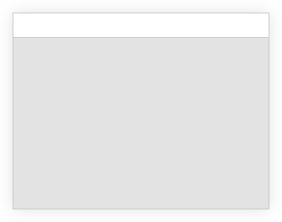

# Custom SDL3 Window

This is a proof of concept for an SDL3 window with a self-drawn non-client area and drop shadow with alpha blending.

The window can be moved and resized using hit tests, and it reacts dynamically to changes in the system theme (light or dark mode) and fractional display scaling for high-pixel-density screens.

Tested on Gnome 48 with Wayland+Mutter.

## Screenshot

## Known Issues

- The window doesn't recognize when it's adjacent to the screen edges, thus it doesn't hide the shadow there
- The rendering isn't adjusted for HDR displays, which causes the shadow to appear much less intense on such displays
